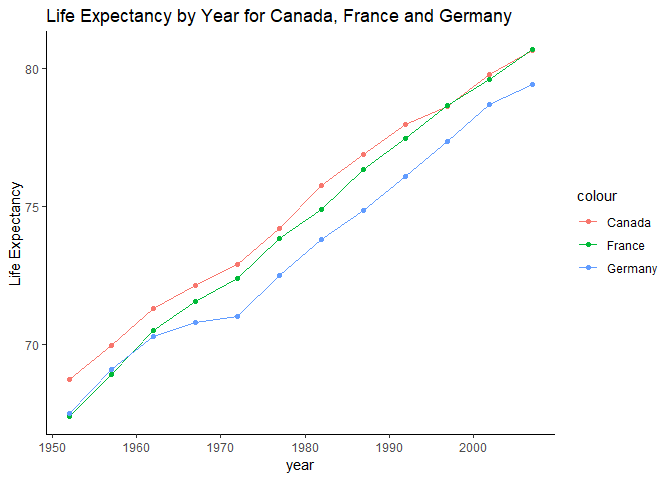
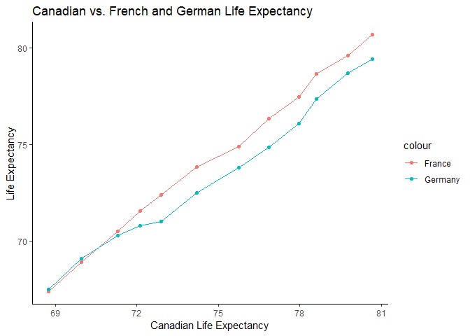

Homework 4
================
Albina Gibadullina
October 9

-   [Introduction](#introduction)
-   [Setting up access to the dataset, downloading needed packages](#setting-up-access-to-the-dataset-downloading-needed-packages)
-   [Data Reshaping Activity \#2](#data-reshaping-activity-2)
    -   [Method 1](#method-1)
    -   [Method 2 using the `spread()` function](#method-2-using-the-spread-function)
    -   [Scatterplots](#scatterplots)
-   [Join Activity \#1](#join-activity-1)
    -   [Inner\_join](#inner_join)
    -   [Full\_join](#full_join)
    -   [Left\_join](#left_join)
    -   [Right\_join](#right_join)

Introduction
------------

In this project, I will be modifying `gapminder` dataset as well as merging `gapminder` dataset with other datasets. Specifically, I will show you how to do:

1.  **Data Reshaping Prompt 2** - Make a tibble with one row per year and columns for life expectancy for two or more countries.
2.  **Join Prompt 1** - Create a second data frame, complementary to Gapminder, join this with Gapminder using a dplyr join function and make some observations about the process and result.

Setting up access to the dataset, downloading needed packages
-------------------------------------------------------------

First, load the `gapminder` R package. Also load tidyverse package - this will also load ggplot2 and dplyr.

``` r
suppressPackageStartupMessages(library(tidyverse))
```

    ## Warning: package 'tidyverse' was built under R version 3.5.1

    ## Warning: package 'ggplot2' was built under R version 3.5.1

    ## Warning: package 'tibble' was built under R version 3.5.1

    ## Warning: package 'tidyr' was built under R version 3.5.1

    ## Warning: package 'readr' was built under R version 3.5.1

    ## Warning: package 'purrr' was built under R version 3.5.1

    ## Warning: package 'dplyr' was built under R version 3.5.1

    ## Warning: package 'stringr' was built under R version 3.5.1

    ## Warning: package 'forcats' was built under R version 3.5.1

``` r
suppressPackageStartupMessages(library(gapminder))
```

    ## Warning: package 'gapminder' was built under R version 3.5.1

Data Reshaping Activity \#2
---------------------------

The goal is to create a new dataframe with one row per year and columns for life expectancy for two or more countries. I selected Canada, France and Germany as my countries.

I will show you how to do this in two ways. First method is done by extracting country's life expectancy data into a new dataframe and combining these dataframes together for multiple countries. Second method is done by using the `spread()` function.

### Method 1

#### Extract annual `lifeExp` data for Canada from `gapminder`

First, let's extract Canadian life-expectancy data into a new data frame.

``` r
LifeExpCanada=gapminder %>% 
  filter(country=="Canada") %>% 
  select(year, lifeExp) # keep only year and life expectancy columns
```

    ## Warning: package 'bindrcpp' was built under R version 3.5.1

``` r
colnames(LifeExpCanada) <- c("Year", "Canada") # rename columns
knitr::kable(LifeExpCanada, format = "markdown")
```

|  Year|  Canada|
|-----:|-------:|
|  1952|  68.750|
|  1957|  69.960|
|  1962|  71.300|
|  1967|  72.130|
|  1972|  72.880|
|  1977|  74.210|
|  1982|  75.760|
|  1987|  76.860|
|  1992|  77.950|
|  1997|  78.610|
|  2002|  79.770|
|  2007|  80.653|

#### Extract annual `lifeExp` data for France from `gapminder`

Next, let's extract French life-expectancy data into a new data frame.

``` r
LifeExpFrance=gapminder %>% 
  filter(country=="France") %>% 
  select(year, lifeExp) # keep only year and life expectancy columns
colnames(LifeExpFrance) <- c("Year", "France") # rename columns
knitr::kable(LifeExpFrance, format = "markdown")
```

|  Year|  France|
|-----:|-------:|
|  1952|  67.410|
|  1957|  68.930|
|  1962|  70.510|
|  1967|  71.550|
|  1972|  72.380|
|  1977|  73.830|
|  1982|  74.890|
|  1987|  76.340|
|  1992|  77.460|
|  1997|  78.640|
|  2002|  79.590|
|  2007|  80.657|

#### Extract annual `lifeExp` data for Germany from `gapminder`

Finally, let's repeat the process for Germany.

``` r
LifeExpGermany=gapminder %>% 
  filter(country=="Germany") %>% 
  select(year, lifeExp) # keep only year and life expectancy columns
colnames(LifeExpGermany) <- c("Year", "Germany") # rename columns
knitr::kable(LifeExpGermany, format = "markdown")
```

|  Year|  Germany|
|-----:|--------:|
|  1952|   67.500|
|  1957|   69.100|
|  1962|   70.300|
|  1967|   70.800|
|  1972|   71.000|
|  1977|   72.500|
|  1982|   73.800|
|  1987|   74.847|
|  1992|   76.070|
|  1997|   77.340|
|  2002|   78.670|
|  2007|   79.406|

#### Combine data frames for three countries into one

We have three separate dataframes for each country. We can use the `left_join` function to merge the dataframes together. We will have to do it in two steps since we can merge only two dataframes at any single time.

``` r
LifeExpCanFran=left_join(LifeExpCanada,LifeExpFrance, by="Year")
LifeExpCountry=left_join(LifeExpCanFran,LifeExpGermany,by="Year")
knitr::kable(LifeExpCountry, format = "markdown")
```

|  Year|  Canada|  France|  Germany|
|-----:|-------:|-------:|--------:|
|  1952|  68.750|  67.410|   67.500|
|  1957|  69.960|  68.930|   69.100|
|  1962|  71.300|  70.510|   70.300|
|  1967|  72.130|  71.550|   70.800|
|  1972|  72.880|  72.380|   71.000|
|  1977|  74.210|  73.830|   72.500|
|  1982|  75.760|  74.890|   73.800|
|  1987|  76.860|  76.340|   74.847|
|  1992|  77.950|  77.460|   76.070|
|  1997|  78.610|  78.640|   77.340|
|  2002|  79.770|  79.590|   78.670|
|  2007|  80.653|  80.657|   79.406|

### Method 2 using the `spread()` function

The previous version took some time. There is an alternative way to get to the same results much faster by using the `spread()` function.

<a href="http://garrettgman.github.io/tidying/">**Garrett Grolemund's website**</a> provides a great explanation of how the `spread()` function works:

> `spread()` returns a copy of your data set that has had the key and value columns removed. In their place, `spread()` adds a new column for each unique value of the key column. These unique values will form the column names of the new columns. `spread()` distributes the cells of the former value column across the cells of the new columns and truncates any non-key, non-value columns in a way that prevents duplication."

In our case, key is `country` and value is `lifeExp` as we moving country values from unique row values to new columns. We will filter for the selected countries as before.

``` r
LifeExpCount=gapminder %>% 
 filter(country == "Canada" | country=="France" | country == "Germany" ) %>%  select(c("year", "country", lifeExp)) %>% # we want to only have year, country and lifeExp variables in our new dataframe
 spread(key="country", value = "lifeExp") # using spread function to move country variables into new columns
 knitr::kable(LifeExpCount, format = "markdown")
```

|  year|  Canada|  France|  Germany|
|-----:|-------:|-------:|--------:|
|  1952|  68.750|  67.410|   67.500|
|  1957|  69.960|  68.930|   69.100|
|  1962|  71.300|  70.510|   70.300|
|  1967|  72.130|  71.550|   70.800|
|  1972|  72.880|  72.380|   71.000|
|  1977|  74.210|  73.830|   72.500|
|  1982|  75.760|  74.890|   73.800|
|  1987|  76.860|  76.340|   74.847|
|  1992|  77.950|  77.460|   76.070|
|  1997|  78.610|  78.640|   77.340|
|  2002|  79.770|  79.590|   78.670|
|  2007|  80.653|  80.657|   79.406|

As we can see, the outcome from Method 1 is equivalent to outcome from Method 2. The difference is that the `spread()` function allows us to do it 3-4x faster.

### Scatterplots

#### Make a scatterplot of `lifeExp` by `country`

We can make a scatterplot of life expectancy for each country by year.

``` r
LifeExpCount %>% 
  ggplot(aes(year)) + 
  geom_line(aes(y = Canada, color = "Canada")) + ## add Canadian Life Exp line
  geom_point(aes(y = Canada, color = "Canada")) + ## add Canadian Life Exp points
  geom_line(aes(y = France, color = "France")) + ## add French Life Exp line
  geom_point(aes(y = France, color = "France")) + ## add French Life Exp points
  geom_line(aes(y = Germany, color = "Germany")) + ## add German Life Exp line
  geom_point(aes(y = Germany, color = "Germany")) + ## add German Life Exp points
  ylab("Life Expectancy") + ## change y-axis label
  labs(title="Life Expectancy by Year for Canada, France and Germany") + 
  theme_classic()
```



#### Make a scatterplot of French and German `lifeExp` by Canadian `lifeExp`

We can also create a life expectancy scatterplot for one country against another by putting life expectancy of one of the countries on the x-axis. In this case, let's put Canadian life expectancy on the x-axis and plot French and German life expectancies against it.

``` r
LifeExpCountry %>% 
  ggplot(aes(Canada)) + 
  geom_line(aes(y = France, color="France")) + ## add French Life Exp line
  geom_point(aes(y = France, color="France")) + ## add French Life Exp points
  geom_line(aes(y = Germany, color = "Germany")) + ## add German Life Exp line
  geom_point(aes(y = Germany, color = "Germany")) + ## add German Life Exp points
  ylab("Life Expectancy") + ## change y-axis label
  xlab("Canadian Life Expectancy") + ## change y-axis label
  labs(title="Canadian vs. French and German Life Expectancy") + 
  theme_classic()
```



We can notice how German life expectancy is falling behind French one.

Join Activity \#1
-----------------

Create a second data frame, complementary to Gapminder. Join it with Gapminder using a dplyr join function and make some observations about the process and result.

I have decided to use the <a href="https://www.ip2location.com/free/country-information">**following dataset from IP2location.com**</a> that provides capital, currency, and language information for each country among some other variables.

First, let's read the excel file:

``` r
IP2data <- read_csv("data file/IP2LOCATION-COUNTRY-INFORMATION.CSV")
```

    ## Parsed with column specification:
    ## cols(
    ##   country_code = col_character(),
    ##   country_name = col_character(),
    ##   country_alpha3_code = col_character(),
    ##   country_numeric_code = col_integer(),
    ##   capital = col_character(),
    ##   total_area = col_double(),
    ##   population = col_integer(),
    ##   idd_code = col_character(),
    ##   currency_code = col_character(),
    ##   currency_name = col_character(),
    ##   lang_code = col_character(),
    ##   lang_name = col_character(),
    ##   cctld = col_character()
    ## )

Use the `glimpse()` function to see characteristics of this data frame

``` r
glimpse(IP2data)
```

    ## Observations: 249
    ## Variables: 13
    ## $ country_code         <chr> "AD", "AE", "AF", "AG", "AI", "AL", "AM",...
    ## $ country_name         <chr> "Andorra", "United Arab Emirates", "Afgha...
    ## $ country_alpha3_code  <chr> "AND", "ARE", "AFG", "ATG", "AIA", "ALB",...
    ## $ country_numeric_code <int> 20, 784, 4, 28, 660, 8, 51, 24, 10, 32, 1...
    ## $ capital              <chr> "Andorra la Vella", "Abu Dhabi", "Kabul",...
    ## $ total_area           <dbl> 468, 83600, 652230, 442, 91, 28748, 29743...
    ## $ population           <int> 76953, 9541615, 36373176, 103050, 15045, ...
    ## $ idd_code             <chr> "376", "971", "93", "1268", "1264", "355"...
    ## $ currency_code        <chr> "EUR", "AED", "AFN", "XCD", "XCD", "ALL",...
    ## $ currency_name        <chr> "Euro", "United Arab Emirates Dirham", "A...
    ## $ lang_code            <chr> "CA", "AR", "FA", "EN", "EN", "SQ", "HY",...
    ## $ lang_name            <chr> "Catalana", "Arabic", "Persian", "English...
    ## $ cctld                <chr> "ad", "ae", "af", "ag", "ai", "al", "am",...

We have 13 distinct variables with 249 observations. Data is cross-sectional, i.e. it was collected at one point in time.

Let's extract four variables from `IP2data` file (`country_name`, `capital` `currency_name` and `lang_name`) and rename some of them.

``` r
CountryInformation <- select(IP2data, country=country_name, capital, currency=currency_name, language=lang_name)

glimpse(CountryInformation)
```

    ## Observations: 249
    ## Variables: 4
    ## $ country  <chr> "Andorra", "United Arab Emirates", "Afghanistan", "An...
    ## $ capital  <chr> "Andorra la Vella", "Abu Dhabi", "Kabul", "Saint John...
    ## $ currency <chr> "Euro", "United Arab Emirates Dirham", "Afghan Afghan...
    ## $ language <chr> "Catalana", "Arabic", "Persian", "English", "English"...

Now, we only have 4 variables left.

Let's check how many countries `gapminder` and `CountryInformation` have in common. Before we do that, we need to transform gapminder dataset from panel data (both cross-sectional and time-series) to cross-sectional data. One of the ways to do this would be to just focus on one of the years, for instance 2002.

``` r
gapminder2002 <- gapminder %>% 
  filter(year==2002)
```

Let's double check data frame parameters of `gapminder2002`

``` r
glimpse(gapminder2002)
```

    ## Observations: 142
    ## Variables: 6
    ## $ country   <fct> Afghanistan, Albania, Algeria, Angola, Argentina, Au...
    ## $ continent <fct> Asia, Europe, Africa, Africa, Americas, Oceania, Eur...
    ## $ year      <int> 2002, 2002, 2002, 2002, 2002, 2002, 2002, 2002, 2002...
    ## $ lifeExp   <dbl> 42.129, 75.651, 70.994, 41.003, 74.340, 80.370, 78.9...
    ## $ pop       <int> 25268405, 3508512, 31287142, 10866106, 38331121, 195...
    ## $ gdpPercap <dbl> 726.7341, 4604.2117, 5288.0404, 2773.2873, 8797.6407...

Here, we have 6 distinct variables with 142 observations. The number of countries in `gapminder2002` is 142 which is less than the number of countries in `CountryInformation` - 249.

Now, let's calculate how many of the `gapminder2002` countries are included in the `CountryInformation` dataframe

``` r
sum(gapminder2002$country %in% CountryInformation$country)
```

    ## [1] 126

The number is 126, meaning that not all of the 142 `gapminder2002` countries appear in the`CountryInformation` dataframe.

### Inner\_join

To avoid missing data for countries, we will use the `inner_join()` function which joins dataframes by ensuring that for a chosen variable (e.g. country), observations are present for each variable, so we should end up with only 126 observations in our new data frame.

``` r
Innerjoin <- inner_join(gapminder2002, CountryInformation, by="country")
```

    ## Warning: Column `country` joining factor and character vector, coercing
    ## into character vector

Let's check the data frame dimensions

``` r
dim(Innerjoin)
```

    ## [1] 126   9

As we expected, we now have 9 variables (1+5+3) with 126 observations for the countries that these dataframes have in common.

Let's see how a part of this dataset looks like (we will only focus on countries in Asia)

``` r
knitr::kable(filter(Innerjoin, continent=="Asia"), format = "markdown")
```

<table>
<colgroup>
<col width="10%" />
<col width="8%" />
<col width="4%" />
<col width="6%" />
<col width="9%" />
<col width="9%" />
<col width="20%" />
<col width="17%" />
<col width="12%" />
</colgroup>
<thead>
<tr class="header">
<th align="left">country</th>
<th align="left">continent</th>
<th align="right">year</th>
<th align="right">lifeExp</th>
<th align="right">pop</th>
<th align="right">gdpPercap</th>
<th align="left">capital</th>
<th align="left">currency</th>
<th align="left">language</th>
</tr>
</thead>
<tbody>
<tr class="odd">
<td align="left">Afghanistan</td>
<td align="left">Asia</td>
<td align="right">2002</td>
<td align="right">42.129</td>
<td align="right">25268405</td>
<td align="right">726.7341</td>
<td align="left">Kabul</td>
<td align="left">Afghan Afghani</td>
<td align="left">Persian</td>
</tr>
<tr class="even">
<td align="left">Bahrain</td>
<td align="left">Asia</td>
<td align="right">2002</td>
<td align="right">74.795</td>
<td align="right">656397</td>
<td align="right">23403.5593</td>
<td align="left">Manama</td>
<td align="left">Bahraini Dinar</td>
<td align="left">Arabic</td>
</tr>
<tr class="odd">
<td align="left">Bangladesh</td>
<td align="left">Asia</td>
<td align="right">2002</td>
<td align="right">62.013</td>
<td align="right">135656790</td>
<td align="right">1136.3904</td>
<td align="left">Dhaka</td>
<td align="left">Bangladeshi Taka</td>
<td align="left">Bangla</td>
</tr>
<tr class="even">
<td align="left">Cambodia</td>
<td align="left">Asia</td>
<td align="right">2002</td>
<td align="right">56.752</td>
<td align="right">12926707</td>
<td align="right">896.2260</td>
<td align="left">Phnom Penh</td>
<td align="left">Cambodian Riel</td>
<td align="left">Khmer</td>
</tr>
<tr class="odd">
<td align="left">China</td>
<td align="left">Asia</td>
<td align="right">2002</td>
<td align="right">72.028</td>
<td align="right">1280400000</td>
<td align="right">3119.2809</td>
<td align="left">Beijing</td>
<td align="left">Chinese Yuan Renminbi</td>
<td align="left">Chinese</td>
</tr>
<tr class="even">
<td align="left">India</td>
<td align="left">Asia</td>
<td align="right">2002</td>
<td align="right">62.879</td>
<td align="right">1034172547</td>
<td align="right">1746.7695</td>
<td align="left">New Delhi</td>
<td align="left">Indian Rupee</td>
<td align="left">Hindi, English</td>
</tr>
<tr class="odd">
<td align="left">Indonesia</td>
<td align="left">Asia</td>
<td align="right">2002</td>
<td align="right">68.588</td>
<td align="right">211060000</td>
<td align="right">2873.9129</td>
<td align="left">Jakarta</td>
<td align="left">Indonesian Rupiah</td>
<td align="left">Indonesian</td>
</tr>
<tr class="even">
<td align="left">Iraq</td>
<td align="left">Asia</td>
<td align="right">2002</td>
<td align="right">57.046</td>
<td align="right">24001816</td>
<td align="right">4390.7173</td>
<td align="left">Baghdad</td>
<td align="left">Iraqi Dinar</td>
<td align="left">Arabic</td>
</tr>
<tr class="odd">
<td align="left">Israel</td>
<td align="left">Asia</td>
<td align="right">2002</td>
<td align="right">79.696</td>
<td align="right">6029529</td>
<td align="right">21905.5951</td>
<td align="left">Jerusalem</td>
<td align="left">Israeli New Shekel</td>
<td align="left">Hebrew</td>
</tr>
<tr class="even">
<td align="left">Japan</td>
<td align="left">Asia</td>
<td align="right">2002</td>
<td align="right">82.000</td>
<td align="right">127065841</td>
<td align="right">28604.5919</td>
<td align="left">Tokyo</td>
<td align="left">Japanese Yen</td>
<td align="left">Japanese</td>
</tr>
<tr class="odd">
<td align="left">Jordan</td>
<td align="left">Asia</td>
<td align="right">2002</td>
<td align="right">71.263</td>
<td align="right">5307470</td>
<td align="right">3844.9172</td>
<td align="left">Amman</td>
<td align="left">Jordanian Dinar</td>
<td align="left">Arabic</td>
</tr>
<tr class="even">
<td align="left">Kuwait</td>
<td align="left">Asia</td>
<td align="right">2002</td>
<td align="right">76.904</td>
<td align="right">2111561</td>
<td align="right">35110.1057</td>
<td align="left">Kuwait</td>
<td align="left">Kuwaiti Dinar</td>
<td align="left">Arabic</td>
</tr>
<tr class="odd">
<td align="left">Lebanon</td>
<td align="left">Asia</td>
<td align="right">2002</td>
<td align="right">71.028</td>
<td align="right">3677780</td>
<td align="right">9313.9388</td>
<td align="left">Beirut</td>
<td align="left">Lebanese Pound</td>
<td align="left">Arabica</td>
</tr>
<tr class="even">
<td align="left">Malaysia</td>
<td align="left">Asia</td>
<td align="right">2002</td>
<td align="right">73.044</td>
<td align="right">22662365</td>
<td align="right">10206.9779</td>
<td align="left">Kuala Lumpur</td>
<td align="left">Malaysian Ringgit</td>
<td align="left">Malay</td>
</tr>
<tr class="odd">
<td align="left">Mongolia</td>
<td align="left">Asia</td>
<td align="right">2002</td>
<td align="right">65.033</td>
<td align="right">2674234</td>
<td align="right">2140.7393</td>
<td align="left">Ulaanbaatar</td>
<td align="left">Mongolian Tugrik</td>
<td align="left">Mongolian</td>
</tr>
<tr class="even">
<td align="left">Myanmar</td>
<td align="left">Asia</td>
<td align="right">2002</td>
<td align="right">59.908</td>
<td align="right">45598081</td>
<td align="right">611.0000</td>
<td align="left">Pyinmana</td>
<td align="left">Myanmar Kyat</td>
<td align="left">Burmese</td>
</tr>
<tr class="odd">
<td align="left">Nepal</td>
<td align="left">Asia</td>
<td align="right">2002</td>
<td align="right">61.340</td>
<td align="right">25873917</td>
<td align="right">1057.2063</td>
<td align="left">Kathmandu</td>
<td align="left">Nepalese Rupee</td>
<td align="left">Nepali</td>
</tr>
<tr class="even">
<td align="left">Oman</td>
<td align="left">Asia</td>
<td align="right">2002</td>
<td align="right">74.193</td>
<td align="right">2713462</td>
<td align="right">19774.8369</td>
<td align="left">Muscat</td>
<td align="left">Omani Rial</td>
<td align="left">Arabic</td>
</tr>
<tr class="odd">
<td align="left">Pakistan</td>
<td align="left">Asia</td>
<td align="right">2002</td>
<td align="right">63.610</td>
<td align="right">153403524</td>
<td align="right">2092.7124</td>
<td align="left">Islamabad</td>
<td align="left">Pakistan Rupee</td>
<td align="left">Urdu</td>
</tr>
<tr class="even">
<td align="left">Philippines</td>
<td align="left">Asia</td>
<td align="right">2002</td>
<td align="right">70.303</td>
<td align="right">82995088</td>
<td align="right">2650.9211</td>
<td align="left">Manila</td>
<td align="left">Philippine Peso</td>
<td align="left">English</td>
</tr>
<tr class="odd">
<td align="left">Saudi Arabia</td>
<td align="left">Asia</td>
<td align="right">2002</td>
<td align="right">71.626</td>
<td align="right">24501530</td>
<td align="right">19014.5412</td>
<td align="left">Riyadh</td>
<td align="left">Saudi Riyal</td>
<td align="left">Arabic</td>
</tr>
<tr class="even">
<td align="left">Singapore</td>
<td align="left">Asia</td>
<td align="right">2002</td>
<td align="right">78.770</td>
<td align="right">4197776</td>
<td align="right">36023.1054</td>
<td align="left">Singapore</td>
<td align="left">Singapore Dollar</td>
<td align="left">English</td>
</tr>
<tr class="odd">
<td align="left">Sri Lanka</td>
<td align="left">Asia</td>
<td align="right">2002</td>
<td align="right">70.815</td>
<td align="right">19576783</td>
<td align="right">3015.3788</td>
<td align="left">Sri Jayewardenepura Kotte</td>
<td align="left">Sri Lanka Rupee</td>
<td align="left">Tamil</td>
</tr>
<tr class="even">
<td align="left">Thailand</td>
<td align="left">Asia</td>
<td align="right">2002</td>
<td align="right">68.564</td>
<td align="right">62806748</td>
<td align="right">5913.1875</td>
<td align="left">Bangkok</td>
<td align="left">Thai Baht</td>
<td align="left">Thai</td>
</tr>
</tbody>
</table>

### Full\_join

We can also try the `full_join()` function which will retain rows for all the countries listed in both data frames. We should still have 9 variables but 265 observations = 249 (\# in CountryInformation) + 142 (\# in gapminder2002) - 126 (joint \# in both)

``` r
Fulljoin <- full_join(gapminder2002, CountryInformation, by="country")
```

    ## Warning: Column `country` joining factor and character vector, coercing
    ## into character vector

Let's check the dimensions of the dataframe

``` r
dim(Fulljoin)
```

    ## [1] 265   9

As expected, we have 9 variables and 265 observations, meaning that some countries are probably listed twice and others have missing data.

### Left\_join

We can also try the `left_join()` function by adding data from `CountryInformation` to `gapminder2002`. We should retain the number of observations present in `gapminder2002` = 142, but still have 9 variables

``` r
Leftjoin <- left_join(gapminder2002, CountryInformation, by="country")
```

    ## Warning: Column `country` joining factor and character vector, coercing
    ## into character vector

Let's check the dimensions of the dataframe

``` r
dim(Leftjoin)
```

    ## [1] 142   9

As expected, we have 9 variables and 142 observations.

### Right\_join

We can also try the `right_join()` function by adding data from `gapminder2002` to `CountryInformation`. We should retain the number of observations present in `CountryInformation` = 249, but still have 9 variables

``` r
Rightjoin <- right_join(gapminder2002, CountryInformation, by="country")
```

    ## Warning: Column `country` joining factor and character vector, coercing
    ## into character vector

Let's check the dimensions of the dataframe

``` r
dim(Rightjoin)
```

    ## [1] 249   9

As expected, we have 9 variables and 249 observations.

Depending on which dataframe you'd want to prioritize in your final dataset, you can use four different functions.
